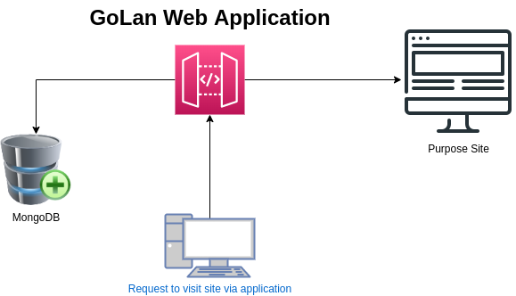

# About Project

This project is a simple web application for URL Shortener. All technologies, that used in this project blong to GoLang and Gin as a framework used.

With this project you can make url in web shorter like <b>Bitly<b>



# Environments

You need to set parameter to define mongodb address. 

`export MONGO_URI=mongodb://localhost:27017`

# How Work

## Define New Short Url

```
curl --location --request POST 'http://localhost:8080/urls' \
--header 'Content-Type: application/json' \
--data-raw '{
    "username":"alireza",
    "address":"http://www.yahoo.com"
}'
```
Response Example:
```
{
    "address": "http://www.yahoo.com",
    "username": "alireza",
    "shorturl": "/tyh"
}
```

## Call Short Url

According to above response our short url of yahoo.com is '/tyh'. to call short url as follow:

```
curl --location --request GET 'http://localhost:8080/u/tyh'
```

you can set this address on your browser `http://localhost:8080/u/tyh`


# Dependencies that used for this project
```
go get -u github.com/gin-gonic/gin
go get go.mongodb.org/mongo-driver/mongo
```

# Run Project

```
go run server.go
```

